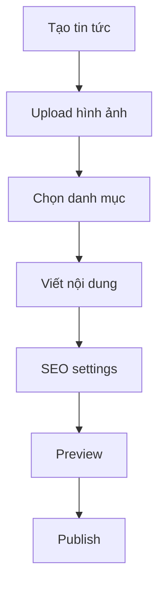
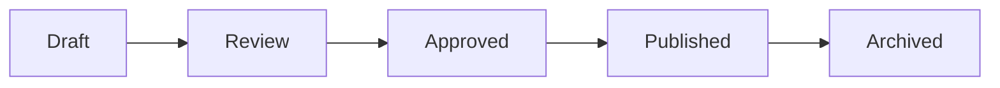

# Quản lý Content

## 📋 Tổng quan

Laravel Admin System cung cấp interface thân thiện để quản lý tất cả content của website.

## 🛍️ Quản lý Sản phẩm

### Thêm sản phẩm mới

1. **Truy cập**: Admin → Sản phẩm → Thêm mới
2. **Điền thông tin**:
   - Tên sản phẩm (Vietnamese/English)
   - Slug (tự động generate nếu để trống)
   - Danh mục sản phẩm
   - Mô tả ngắn/chi tiết
   - Giá, giá khuyến mãi
   - Trạng thái, thứ tự
3. **Upload hình ảnh**:
   - Hình đại diện (single)
   - Hình chi tiết (multiple)
4. **Lưu**: Chọn "Lưu và tiếp tục" hoặc "Lưu và quay lại"

### Tính năng nâng cao

- ✅ **Auto WebP conversion** - Tối ưu performance
- ✅ **Unique slug** - SEO friendly URLs
- ✅ **Image resize** - Consistent image sizes
- ✅ **Bulk operations** - Select all/delete multiple
- ✅ **Search & filter** - By category, status, name

## 📰 Quản lý Tin tức

### Workflow tin tức



### Form fields

- **Tiêu đề**: Vietnamese + English
- **Slug**: Auto-generated hoặc custom
- **Danh mục**: Chọn từ tree structure
- **Tóm tắt**: Meta description
- **Nội dung**: CKEditor với media library
- **Hình ảnh**: Đại diện + chi tiết
- **SEO**: Meta title, description, keywords
- **Settings**: Status, featured, home display

## 📄 Quản lý Trang

### Các loại trang

1. **Static pages**: Giới thiệu, Liên hệ, Chính sách
2. **Dynamic pages**: Landing pages, Campaign pages
3. **System pages**: 404, Maintenance

### Page builder features

- **Rich text editor**: CKEditor integration
- **Media library**: Image/file management
- **Template system**: Reusable layouts
- **SEO optimization**: Meta tags, structured data

## 🎨 Quản lý Slider

### Slider types

1. **Homepage slider**: Main banner
2. **Category sliders**: Product showcases
3. **Promotional sliders**: Campaign banners

### Configuration

```php
// Slider settings
$sliderConfig = [
    'autoplay' => true,
    'duration' => 5000,
    'transition' => 'slide',
    'arrows' => true,
    'dots' => true
];
```

## 📂 Quản lý Danh mục

### Cấu trúc cây

```
Danh mục cha
├── Danh mục con 1
│   ├── Danh mục cháu 1
│   └── Danh mục cháu 2
└── Danh mục con 2
    └── Danh mục cháu 3
```

### Tính năng

- **Unlimited levels**: Không giới hạn cấp độ
- **Drag & drop**: Sắp xếp thứ tự
- **Bulk operations**: Mass edit/delete
- **SEO friendly**: Custom slugs cho mỗi category

## 🔧 Tính năng chung

### Image Processing

Tất cả images được xử lý tự động:

```php
// Auto processing
- Resize to optimal dimensions
- Convert to WebP format
- Quality optimization (80%)
- Generate thumbnails
- Watermark (optional)
```

### SEO Optimization

- **Meta tags**: Title, description, keywords
- **Open Graph**: Social media sharing
- **Structured data**: Schema.org markup
- **Sitemap**: Auto-generation
- **Unique slugs**: Conflict resolution

### Bulk Operations

Các thao tác hàng loạt:

1. **Select all**: Checkbox functionality
2. **Bulk delete**: Multiple records
3. **Status change**: Enable/disable multiple
4. **Category move**: Bulk category assignment

### Search & Filter

Advanced filtering options:

- **Text search**: Name, content, description
- **Category filter**: By category tree
- **Status filter**: Active/inactive/draft
- **Date range**: Created/updated dates
- **Custom filters**: Per module specific

## 📱 Responsive Design

Admin interface hoạt động tốt trên:

- **Desktop**: Full features
- **Tablet**: Optimized layout
- **Mobile**: Touch-friendly interface

## 🔐 Permissions

Role-based access control:

```php
// Permission levels
- Super Admin: Full access
- Admin: Content management
- Editor: Content edit only
- Viewer: Read-only access
```

## 📊 Analytics Integration

Track content performance:

- **Page views**: Individual page statistics
- **Popular content**: Most viewed items
- **User engagement**: Time on page, bounce rate
- **Conversion tracking**: Goals and events

## 💡 Tips & Best Practices

### Content Writing

1. **SEO-friendly titles**: Include target keywords
2. **Meta descriptions**: 150-160 characters
3. **Image alt text**: Descriptive alternative text
4. **Internal linking**: Link related content
5. **Content structure**: Use headings (H1-H6)

### Image Optimization

1. **File naming**: Descriptive filenames
2. **Alt text**: SEO and accessibility
3. **File size**: Balance quality vs. performance
4. **Dimensions**: Consistent aspect ratios
5. **WebP format**: Automatic conversion

### Performance

1. **Lazy loading**: Images load on demand
2. **Caching**: Browser and server-side caching
3. **CDN**: Content delivery network
4. **Minification**: CSS/JS compression
5. **Database optimization**: Efficient queries

## 🚀 Advanced Features

### Content Scheduling

```php
// Schedule content publication
$content->publish_at = '2024-12-25 00:00:00';
$content->expire_at = '2024-12-31 23:59:59';
```

### Multi-language Support

- **Vietnamese**: Primary language
- **English**: Secondary language
- **Auto-translation**: Google Translate integration (optional)

### Content Templates

Reusable content structures:

1. **Product templates**: Standard product layouts
2. **Article templates**: News article formats
3. **Landing page templates**: Marketing pages
4. **Email templates**: Newsletter formats

### Workflow Management

